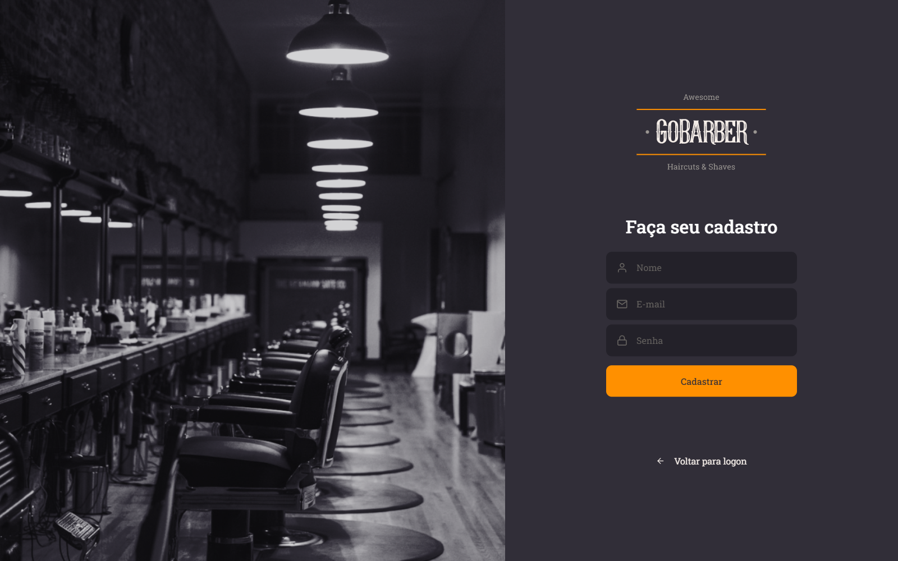
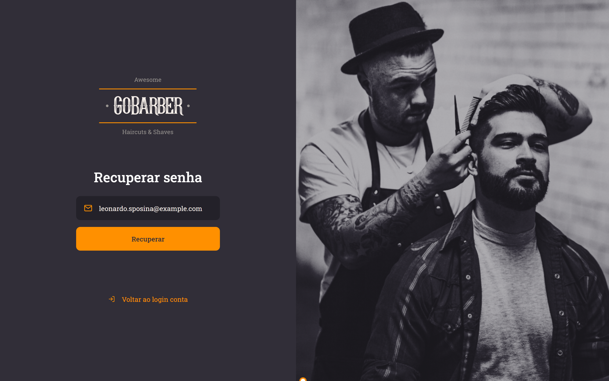
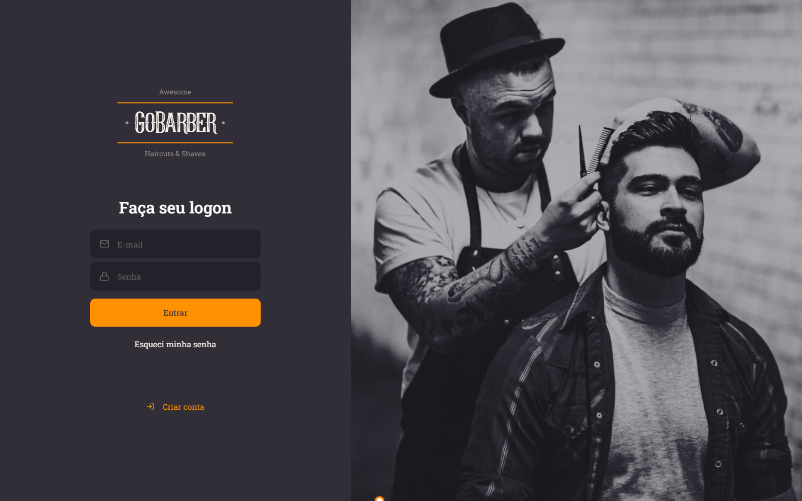
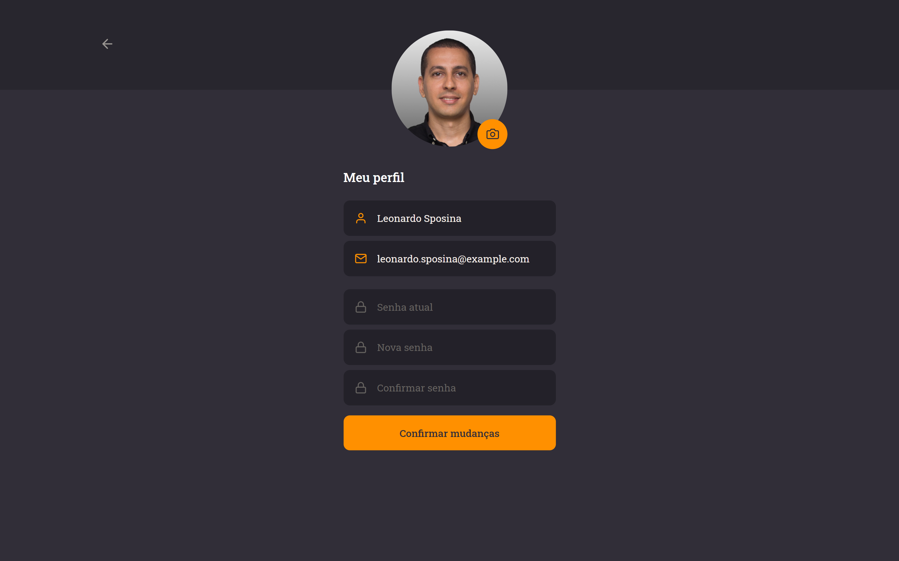
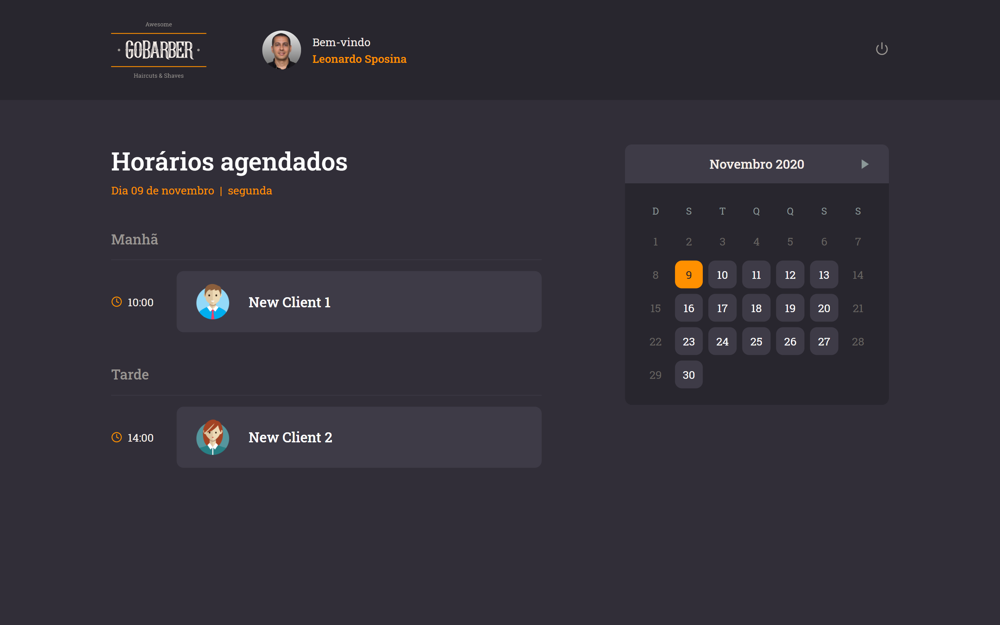

![GoStack][logo]

## GoBarber Web App

[](https://app.netlify.com/sites/gobarber-react-frontend/deploys) [][deploy]

---

### 📷 Screenshots







---

### 📝 Instructions (development)

1. Install all dependencies:

    ```bash
    yarn
    ```

2. Create a ```.env``` file in the root folder of the project with the custom environment variable as described in the ```.env.example``` file.

3. Run the project in development mode:

    ```bash
    yarn start
    ```

---

### ⚙ Deploy

Project deployed to **Netlify** with a CD/CI pipeline enabled on the *main* branch.

---

### 👨‍🎨️ Layout

[Figma][figma-layout]

[logo]: https://github.com/leonardosposina/gostack13-lv01-d01/blob/master/docs/gostack-bootcamp.png?raw=true
[figma-layout]: https://www.figma.com/file/BXCihtXXh9p37lGsENV614/GoBarber
[deploy]: https://gobarber.leonardosposina.dev/
